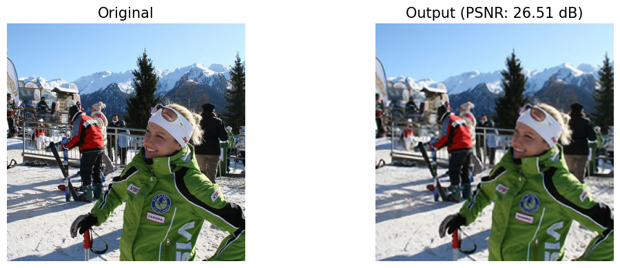

# RASR: Region-Adaptive Super-Resolution

  

**RASR** is a PyTorch pipeline for image super-resolution / reconstruction
under a memory budget: **MRIMCNN** selects the most important patches and
**UDUCNN** reconstructs the image around them.

## Overview

A learned **region-sensing** module predicts a per-patch importance map and,
under a fixed memory budget `K`, keeps only the **top-K most important patches**
at high resolution. The retained patches are blended into a CNN-upscaled base
image,

```
reconstructed = upscaled + (hr - upscaled) * mask
```

modelling a memory-constrained sensing device (e.g. a UAV) that cannot afford
to fetch every patch at full resolution.

## Pipeline


Each stage upscales 2x (Reconstruction) and then blends in the true
high-resolution patches selected by the importance mask (Sensing) under the
memory budget: stage (a) reconstructs 128 → 256 against the 256² reference,
and stage (b) repeats the same composition at 256 → 512.

Each model lives in its own module under `models/`. The final pipeline uses
**UDUCNN** for reconstruction and **MRIMCNN** for patch selection; the rest
are compared against them.

- **Upscalers** (all net 2x)
  - `TransConv` — single transposed-conv upscaler
  - `UDUCNN` — up / down / up CNN
  - `UUDCNN` — up / up / down CNN (refines features at 4x)
- **Region selection / importance masks**
  - `IMCNN` — single-resolution importance-mask CNN
  - `MRIMCNN` — multi-resolution importance-mask CNN (fuses full/½/¼ scales)

The memory budget is `total_memory = 128 * 128`, so `K = total_memory / patch_size²`
patches are kept. Models are trained with MSE loss, Adam, and a StepLR
schedule, and evaluated by PSNR, including a two-stage `128 -> 256 -> 512`
reconstruction.

## Structure

```
RASR/
├── models/            # one module per model
│   ├── blocks.py      # ResidualBlock, ResidualBlock2
│   ├── transconv.py   # TransConv
│   ├── uducnn.py      # UDUCNN
│   ├── uudcnn.py      # UUDCNN
│   ├── imcnn.py       # IMCNN
│   └── mrimcnn.py     # MRIMCNN
├── train_upscale.py   # train an upscaler
├── train_region.py    # train region selection through a frozen upscaler
├── test.py            # PSNR evaluation of the pipelines
├── assets/            # result figures (shown below)
└── requirements.txt
```

## Dataset

Training and evaluation use **COCO** images as high-resolution ground truth;
LR/HR pairs are generated on the fly by bicubic downsampling, so all you need
is a folder of images.

The dataset is **not included**. Download images from
[cocodataset.org](http://cocodataset.org) (any split works — only the images
are used, no annotations) and place them in two folders, e.g.:

```
data/COCO/Train/   # training images
data/COCO/Test/    # held-out test images
```

## Usage

```bash
pip install -r requirements.txt

# 1. Train an upscaler (transconv / uducnn / uudcnn)
python train_upscale.py --data-dir data/COCO/Train --model uducnn --epochs 50

# 2. Train region selection (imcnn / mrimcnn) through the frozen upscaler
python train_region.py --data-dir data/COCO/Train --model mrimcnn \
    --upscaler uducnn --upscaler-ckpt weights/uducnn.pt

# 3. Evaluate PSNR across the pipelines
python test.py --data-dir data/COCO/Test --weights-dir weights
```

Region selection trains end-to-end through the frozen upscaler: the soft mask
blends true HR patches into the upscaled image and the MSE loss teaches it to
spend the patch budget where the upscaler's error is largest (at eval time the
mask switches to a hard top-K selection).

Run `python train_upscale.py -h` / `python train_region.py -h` for all
hyper-parameters (LR size, batch size, learning rate, scheduler, patch size,
temperature). `test.py` expects the
weight file names listed in `WEIGHT_FILES` at the top of the script inside
`--weights-dir`, and skips any pipeline whose weights are missing.
`--viz-image <path>` additionally renders a qualitative side-by-side
comparison.

## Results

Numbers from the COCO training runs (average PSNR over the test set).

Upscalers (128 → 256):

| Model | SRCNN (baseline) | TransConv | UDUCNN | UUDCNN |
| --- | --- | --- | --- | --- |
| Parameters | 56K | 160K | 260K | 450K |
| Training time | 55m | 73m | 1h 52m | 4h |
| Avg PSNR (dB) | 28.21 | 30.85 | **31.23** | 31.13 |

Region selection (top-K blending on top of a pretrained UDUCNN, same memory
budget for every column):

| Selection | Random (baseline) | MRIMCNN (patch 1) | MRIMCNN (patch 2) | MRIMCNN (patch 4) |
| --- | --- | --- | --- | --- |
| Parameters | — | 16.6K | 16.6K | 16.6K |
| Avg PSNR (dB) | ~29.8 | 36.72 | **36.81** | 36.54 |

Learned selection buys roughly **+7 dB** over spending the same patch budget
at random; average pooling beats max pooling by ~1 dB when compressing the
importance map into the patch grid. (`IMCNN`, the single-resolution variant,
has 5.5K parameters.)

A 512² COCO test image next to the cascaded `UUDCNN` → `IMCNN` reconstruction
from those runs:


