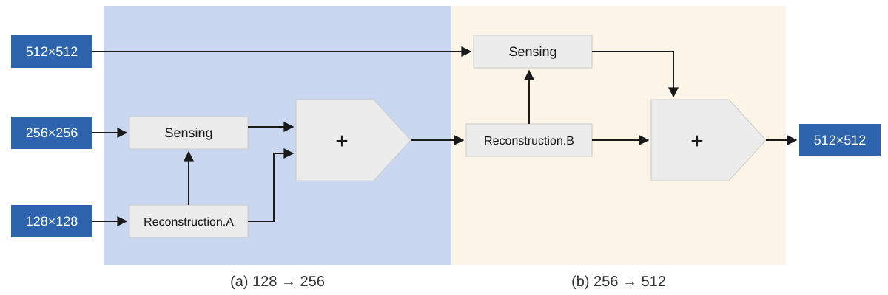
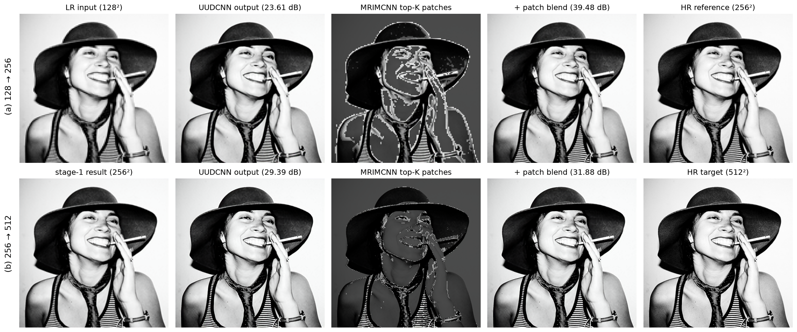

# RASR: Region-Adaptive Super-Resolution

  

**RASR** is a PyTorch pipeline for image super-resolution / reconstruction
under a memory budget: **MRIMCNN** selects the most important patches and
**UUDCNN** reconstructs the image around them.

## Overview

A reconnaissance UAV can capture only **128² pixels per shot**, at any
altitude — flying high covers the whole scene coarsely, flying low sees a
small area sharply. RASR pairs the UAV with a server that has no such limit
and learns **where each lower, sharper pass should look**:

1. **Highest pass** — the UAV captures the whole scene in one 128² shot and
   sends it to the server.
2. The server upscales the shot 2x with a CNN and predicts a per-patch
   **importance map** over the upscaled view, then replies with the
   coordinates of the **top-K most important patches** — K sized so the
   patches fill exactly one more 128² shot (`K = 128² / patch_size²`).
3. **Mid pass** — the UAV descends and captures just those regions at twice
   the ground resolution; the server blends them into its upscaled base:

   ```
   reconstructed = upscaled + (hr - upscaled) * mask
   ```

4. **Lowest pass** — the same loop repeats on the 256² reconstruction,
   yielding a 512² image.

The server ends up with a 512² reconstruction while the UAV captured and
transmitted only 3 × 128² pixels — about 19% of a full-resolution scan.
Evaluation simulates the UAV's shots by bicubic-resizing a source image (see
Dataset).

## Pipeline



Each stage upscales 2x (Reconstruction) and then blends in the real patches
captured by the next, lower pass (Sensing), each pass spending the same 128²
budget: stage (a) is the mid-altitude pass reconstructing 128 → 256, and
stage (b) is the lowest pass repeating the composition at 256 → 512.

Each model lives in its own module under `models/`. The final pipeline uses
**UUDCNN** for reconstruction and **MRIMCNN** for patch selection — the best
of each family in the measurements below; the rest are compared against them.

- **Upscalers** (all net 2x)
  - `TransConv` — single transposed-conv upscaler
  - `UDUCNN` — up / down / up CNN
  - `UUDCNN` — up / up / down CNN (refines features at 4x)
- **Region selection / importance masks**
  - `IMCNN` — single-resolution importance-mask CNN
  - `MRIMCNN` — multi-resolution importance-mask CNN (fuses full/½/¼ scales)

Models are trained with MSE loss, Adam, and a StepLR schedule, and evaluated
by PSNR, including a two-stage `128 -> 256 -> 512` reconstruction.

## Structure

```
RASR-SuperResolution/
├── models/            # one module per model
│   ├── blocks.py      # ResidualBlock, ResidualBlock2
│   ├── transconv.py   # TransConv
│   ├── uducnn.py      # UDUCNN
│   ├── uudcnn.py      # UUDCNN
│   ├── imcnn.py       # IMCNN
│   └── mrimcnn.py     # MRIMCNN
├── train_upscale.py   # train an upscaler
├── train_region.py    # train region selection through a frozen upscaler
├── test.py            # PSNR evaluation of the pipelines
├── assets/            # result figures (shown below)
└── requirements.txt
```

## Dataset

Training and evaluation use **COCO** images as high-resolution ground truth;
LR/HR pairs are generated on the fly by bicubic downsampling, so all you need
is a folder of images.

The dataset is **not included**. Download images from
[cocodataset.org](http://cocodataset.org) (any split works — only the images
are used, no annotations) and place them in two folders, e.g.:

```
data/COCO/Train/   # training images
data/COCO/Test/    # held-out test images
```

## Usage

```bash
pip install -r requirements.txt

# 1. Train an upscaler (transconv / uducnn / uudcnn)
python train_upscale.py --data-dir data/COCO/Train --model uudcnn --epochs 50

# 2. Train region selection (imcnn / mrimcnn) through the frozen upscaler
python train_region.py --data-dir data/COCO/Train --model mrimcnn \
    --upscaler uudcnn --upscaler-ckpt weights/uudcnn.pt

# 3. Evaluate PSNR across the pipelines
python test.py --data-dir data/COCO/Test --weights-dir weights
```

Region selection trains end-to-end through the frozen upscaler: the soft mask
blends true HR patches into the upscaled image and the MSE loss teaches it to
spend the patch budget where the upscaler's error is largest (at eval time the
mask switches to a hard top-K selection).

Run `python train_upscale.py -h` / `python train_region.py -h` for all
hyper-parameters (LR size, batch size, learning rate, scheduler, patch size,
temperature). `test.py` expects the
weight file names listed in `WEIGHT_FILES` at the top of the script inside
`--weights-dir`, and skips any pipeline whose weights are missing.
`--viz-image <path>` additionally renders a qualitative side-by-side
comparison.

## Results

Measured with this repository's code: every model trained for 50 epochs
(batch 4, Adam 1e-3, StepLR) on **3,000 COCO train2017 images** and evaluated
as the average PSNR over **500 COCO val2017 images** (128 → 256).

Upscalers:

| Model | SRCNN (vanilla) | TransConv | UDUCNN | UUDCNN |
| --- | --- | --- | --- | --- |
| Parameters | 56K | 209K | 264K | 376K |
| Avg PSNR (dB) | 28.21 | 30.78 | 30.99 | **31.10** |

Region selection (mask patch size 2, hard top-K at evaluation) on top of the
best upscaler, UUDCNN:

| Pipeline | UUDCNN only | UUDCNN + IMCNN | UUDCNN + MRIMCNN |
| --- | --- | --- | --- |
| Mask parameters | — | 5.5K | 16.6K |
| Avg PSNR (dB) | 31.10 | 36.90 | **36.98** |

Stage by stage on a COCO val2017 image — the mask spends the patch budget on
the detail-heavy regions (face, hat boundary) and skips the flat background,
lifting this image from 23.44 dB to 39.37 dB:


